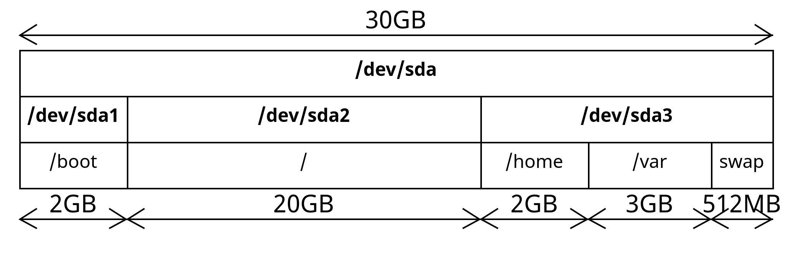
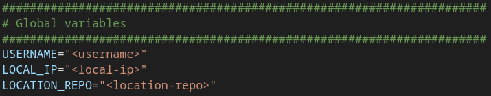
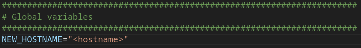

# deploy-gentoo

This repository contains everything you need to install Gentoo Linux on your computer with a few basic services.

Here are the most important files :

- **install-amd64-minimal-20240128T165521Z.iso** : Gentoo Linux ISO image, version 28/01/2024

- **stage3-amd64-openrc-20240121T170320Z.tar.xz** : Gentoo Linux base, version 12/01/2024

- **portage-latest.tar.bz2** : applications base

- **distfiles.tar.bz2** : pre-downloaded applications

- **packages.tar.bz2** : pre-compiled applications

## Configuration example

This is the configuration used to install Gentoo Linux throughout the tutorial ([Getting started](#getting-started)).

**30GB** hard drive and **4GB** RAM.



## Applications installed

- ```cronie```
- ```dhcpcd```
- ```grub```
- ```ssh```
- ```syslog-ng```
- ```apache```
- ```proftpd```

## Prerequisites

Clone this repository in your local computer :

```sh
git clone git@github.com:avirgos/deploy-gentoo.git
```

Replace the variables in ```install-gentoo.sh``` Bash script :



- ```<username>``` : your username in your local computer
- ```<local-ip>``` : your IP adress in your local computer. Do ```ip a``` command to get this IP address
- ```<location-repo>``` : absolute path of the repository cloned. Do ```pwd``` inside this repository to get the absolute path. 
**Make sure to remove ```/deploy-gentoo``` !**

Replace the variable in ```manage-gentoo.sh``` Bash script :



- ```<hostname>``` : hostname of your Gentoo Linux machine

## Getting started